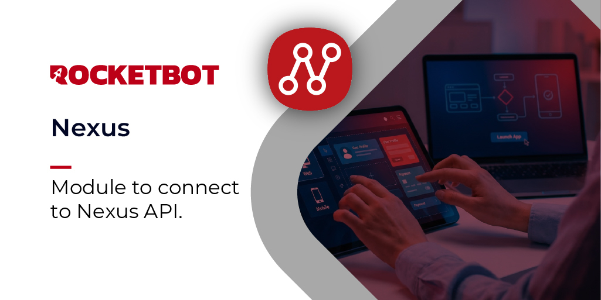

# Nexus
  
Módulo para conectarse a la API de Nexus, permitiendo leer/escribir datos y escuchar eventos en tiempo real.  

*Read this in other languages: [English](Manual_Nexus.md), [Português](Manual_Nexus.pr.md), [Español](Manual_Nexus.es.md)*
  

## Como instalar este módulo
  
Para instalar el módulo en Rocketbot Studio, se puede hacer de dos formas:
1. Manual: __Descargar__ el archivo .zip y descomprimirlo en la carpeta modules. El nombre de la carpeta debe ser el mismo al del módulo y dentro debe tener los siguientes archivos y carpetas: \__init__.py, package.json, docs, example y libs. Si tiene abierta la aplicación, refresca el navegador para poder utilizar el nuevo modulo.
2. Automática: Al ingresar a Rocketbot Studio sobre el margen derecho encontrara la sección de **Addons**, seleccionar **Install Mods**, buscar el modulo deseado y presionar install.  

## Descripción de los comandos

### Conectar a Nexus
  
Establece una sesión con la API de Nexus usando una API Key.
|Parámetros|Descripción|ejemplo|
| --- | --- | --- |
|URL base|URL base del servidor de Rocketview (ej. https//rocketview.myrb.io).|https://rocketview.myrb.io|
|API Key|API Key generada en la configuración de la app en Nexus.|rv_xxxxxxxxxxxxxxxx|
|Nombre de sesión|Nombre único para identificar esta sesión de conexión.|default|
|Variable resultado|Variable donde se almacenará True si la conexión es exitosa.|resultado|

### Listar Tablas
  
Retorna todas las tablas disponibles para esta API Key.
|Parámetros|Descripción|ejemplo|
| --- | --- | --- |
|Nombre de sesión|Nombre de sesión utilizado al conectar.|default|
|Variable resultado|Variable donde se almacenará la lista de tablas.|tablas|

### Obtener Tabla
  
Retorna la definición de una tabla por su ID.
|Parámetros|Descripción|ejemplo|
| --- | --- | --- |
|ID de tabla|ID de la tabla a obtener.|id-de-la-tabla|
|Nombre de sesión|Nombre de sesión utilizado al conectar.|default|
|Variable resultado|Variable donde se almacenará la definición de la tabla.|tabla|

### Crear Tabla
  
Crea una nueva tabla.
|Parámetros|Descripción|ejemplo|
| --- | --- | --- |
|Definición de tabla (JSON)|Objeto JSON con el nombre y columnas de la tabla.|{"name": "productos", "columns": []}|
|Nombre de sesión|Nombre de sesión utilizado al conectar.|default|
|Variable resultado|Variable donde se almacenará la tabla creada.|nueva_tabla|

### Actualizar Tabla
  
Actualiza metadatos de la tabla (nombre, columnas).
|Parámetros|Descripción|ejemplo|
| --- | --- | --- |
|ID de tabla|ID de la tabla a actualizar.|id-de-la-tabla|
|Datos actualizados (JSON)|Objeto JSON con los campos a actualizar.|{"name": "nuevo_nombre"}|
|Nombre de sesión|Nombre de sesión utilizado al conectar.|default|
|Variable resultado|Variable donde se almacenará la tabla actualizada.|tabla_actualizada|

### Eliminar Tabla
  
Elimina permanentemente una tabla y todas sus filas.
|Parámetros|Descripción|ejemplo|
| --- | --- | --- |
|ID de tabla|ID de la tabla a eliminar.|id-de-la-tabla|
|Nombre de sesión|Nombre de sesión utilizado al conectar.|default|
|Variable resultado|Variable donde se almacenará True si la tabla fue eliminada.|resultado|

### Actualizar Celda
  
Actualiza el valor de una celda en una fila.
|Parámetros|Descripción|ejemplo|
| --- | --- | --- |
|ID de tabla|ID de la tabla.|id-de-la-tabla|
|ID de fila|ID de la fila a actualizar.|id-de-la-fila|
|Nombre de columna|Nombre de la columna a actualizar.|precio|
|Nuevo valor|El nuevo valor para la celda.|99.99|
|Nombre de sesión|Nombre de sesión utilizado al conectar.|default|
|Variable resultado|Variable donde se almacenará la respuesta.|fila_actualizada|

### Obtener Filas
  
Obtiene filas de una tabla de Nexus.
|Parámetros|Descripción|ejemplo|
| --- | --- | --- |
|ID de tabla|ID de la tabla de Nexus de la cual leer.|id-de-la-tabla|
|Límite (opcional)|Número máximo de filas a retornar. Por defecto 100.|100|
|Desplazamiento (opcional)|Número de filas a omitir. Por defecto 0.|0|
|Nombre de sesión|Nombre de sesión utilizado al conectar.|session|
|Variable resultado|Variable donde se almacenará la lista de filas.|filas|

### Insertar Fila
  
Inserta una nueva fila en una tabla de Nexus.
|Parámetros|Descripción|ejemplo|
| --- | --- | --- |
|ID de tabla|ID de la tabla donde se insertará la fila.|id-de-la-tabla|
|Datos de la fila (JSON)|Objeto JSON con los pares columna/valor a insertar.|{"campo1": "valor1", "precio": 99.99}|
|Nombre de sesión|Nombre de sesión utilizado al conectar.|session|
|Variable resultado|Variable donde se almacenará la fila insertada (con su ID).|nueva_fila|

### Actualizar Fila
  
Actualiza una fila existente por su ID.
|Parámetros|Descripción|ejemplo|
| --- | --- | --- |
|ID de fila|ID de la fila a actualizar.|id-de-la-fila|
|Datos actualizados (JSON)|Objeto JSON con los campos a actualizar.|{"precio": 199.99, "stock": 5}|
|Nombre de sesión|Nombre de sesión utilizado al conectar.|session|
|Variable resultado|Variable donde se almacenará la fila actualizada.|fila_actualizada|

### Eliminar Fila
  
Elimina una fila por su ID.
|Parámetros|Descripción|ejemplo|
| --- | --- | --- |
|ID de fila|ID de la fila a eliminar.|id-de-la-fila|
|Nombre de sesión|Nombre de sesión utilizado al conectar.|session|
|Variable resultado|Variable donde se almacenará True si la fila fue eliminada.|resultado|

### Eliminar Todas las Filas
  
Borra todas las filas de una tabla sin eliminar la tabla.
|Parámetros|Descripción|ejemplo|
| --- | --- | --- |
|ID de tabla|ID de la tabla a vaciar.|id-de-la-tabla|
|Nombre de sesión|Nombre de sesión utilizado al conectar.|default|
|Variable resultado|Variable donde se almacenará True si fue exitoso.|resultado|

### Listar Consultas
  
Retorna todas las consultas guardadas para esta API Key.
|Parámetros|Descripción|ejemplo|
| --- | --- | --- |
|Nombre de sesión|Nombre de sesión utilizado al conectar.|default|
|Variable resultado|Variable donde se almacenará la lista de consultas.|consultas|

### Ejecutar Query
  
Ejecuta una query guardada en Nexus con parámetros opcionales.
|Parámetros|Descripción|ejemplo|
| --- | --- | --- |
|ID de query|ID de la query a ejecutar.|id-de-la-query|
|Parámetros (JSON, opcional)|Objeto JSON con parámetros dinámicos para la query.|{"busqueda": "laptop", "precioMin": 100}|
|Nombre de sesión|Nombre de sesión utilizado al conectar.|session|
|Variable resultado|Variable donde se almacenará el resultado de la query.|resultado_query|
